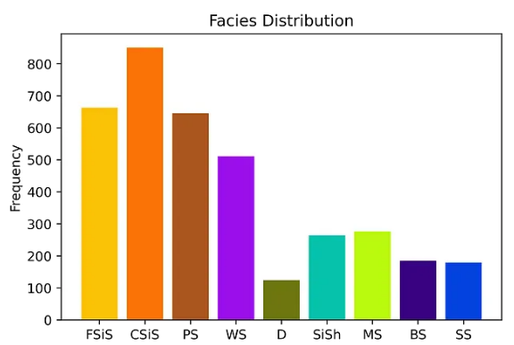
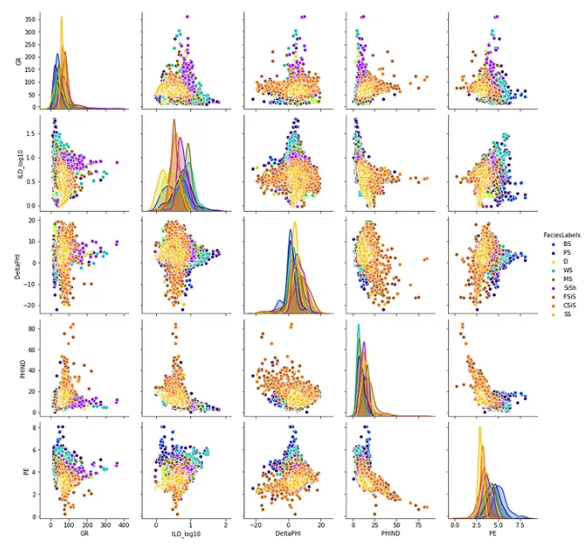

# KDSmel.github.io

# Exploratory Geoscience Data Analysis: Multi-class Classification Problem


Although there are tons of great books and papers outside to practice machine learning, I always wanted to see something short, simple, and with a descriptive manuscript. I always wanted to see an example with an appropriate explanation of the procedure accompanied by detailed results interpretation. Model evaluation metrics should also need to be elaborated clearly.

In this work, I will try to include all important steps of ML modeling (even though some are not necessary for this dataset) to make a consistent and tangible example, especially for geoscientists. Eight important ML algorithms will be examined and results will be compared. I will try to have an argumentative model evaluation discussion. I will not go deep into the algorithm’s fundamentals.

To access the dataset and jupyter notebook find out my Git.
Note1: codes embedded in this manuscript are presented to understand the work procedure. If you want to exercise by yourself, I highly recommend using the [jupyter notebook file]([https://write.geeksforgeeks.org/](https://github.com/mardani72/Practical_ML_Tutorial_Facies_examp/blob/main/Part1_practical_Tut_ML_facies.ipynb)).
Note2: shuffling data can cause differences between your runs and what appears here.

This tutorial has four parts:

Part.1: Exploratory Data Analysis,

Part.2: Build Model & Validate,

Part.3: Model Evaluation-1,

Part.4: Model Evaluation-2


**1. Exploratory Data Analysis**

   1.1. Data visualization
      
      1–1–1 log-plot
      
      1–1–2 Bar plot
      
      1–1–3 Cross-plot
      
   1–2 Feature Engineering
   
      1–2–1 NaN imputation
      
      1–2–2 Feature extraction
      
      1–2–3 Oversampling
      
   1–3 Feature Importance
   
      1–3–1 Feature linear correlation
      
      1–3–2 Decision tree
      
      1–3–3 Permutation feature importance

**2- Build Model & Validate**

      2–1 Baseline Model
      
      2–2 Hyper-parameters
      
      2–2–1 Grid search

**3- Model Evaluation-1**

      3–1 Model metrics plot
      
      3–2 Confusion matrix

**4- Model Evaluation-2**

      4–1 Learning curves
      
      4–2 ROC plot
      
      4–3 Blind well prediction and evaluation

If you are totally fresh with python and ML concepts, you will need to get familiar with the basics to get advantages of this tutorial. As the dataset that we will work on here is a tabular CSV file including well logs and facies class, my two previous posts (10 steps in Pandas, 5 steps in Pandas) can be helpful for well log data handling, processing, and plotting. All implementation is based on scikit-learn libraries.

**Data Summary**

The dataset (facies_vectors.csv)for this study comes from Hugoton and Panoma Fields in North America. It consists of log data(the measurement of physical properties of rocks) of nine wells. We will use these log data to train supervised classifiers in order to predict discrete facies groups. For more detail, you may take a look here. The seven features are:

1. GR: this wireline logging tools measure gamma emission
2. ILD_log10: this is resistivity measurement
3. PE: photoelectric effect log
4. DeltaPHI: Phi is a porosity index in petrophysics.
5. PNHIND: Average of neutron and density log.
6. NM_M:nonmarine-marine indicator
7. RELPOS: relative position
   
The nine discrete facies (classes of rocks) are:

1. (SS) Nonmarine sandstone
2. (CSiS) Nonmarine coarse siltstone
3. (FSiS) Nonmarine fine siltstone
4. (SiSH) Marine siltstone and shale
5. (MS) Mudstone (limestone)
6. (WS) Wackestone (limestone)
7. (D) Dolomite
8. (PS) Packstone-grainstone (limestone)
9. (BS) Phylloid-algal bafflestone (limestone)
    
## Part.1: Exploratory Data Analysis
After data reading into python using Pandas, we can visualize it to understand data better. Before plotting, we need to define a color map(this step deserves to be in the Feature engineering part but we need here to plot color for facies classes) and devote color code for each facies.

**1–1 Data visualization**
1–1–1 log-plot

```python
import pandas as pd
import matplotlib.colors as colors
import matplotlib.pyplot as plt
from mpl_toolkits.axes_grid1 import make_axes_locatable
from sklearn.preprocessing import LabelEncoder
from collections import Counter
pd.set_option('display.max_rows', 30)
import numpy as np
import seaborn as sns

df = pd.read_csv('facies_vectors.csv')

# colors 
facies_colors = ['xkcd:goldenrod', 'xkcd:orange','xkcd:sienna','xkcd:violet',
       'xkcd:olive','xkcd:turquoise', "xkcd:yellowgreen", 'xkcd:indigo', 'xkcd:blue']

facies_labels = ['SS', 'CSiS', 'FSiS', 'SiSh', 
                 'MS',  'WS', 'D','PS', 'BS']
#facies_color_map is a dictionary that maps facies labels to their respective colors
facies_color_map = {}
for ind, label in enumerate(facies_labels):
    facies_color_map[label] = facies_colors[ind]

def label_facies(row, labels):
    return labels[ row['Facies'] -1]
#establish facies label str    
df.loc[:,'FaciesLabels'] = df.apply(lambda row: label_facies(row, facies_labels), axis=1)
```


This is a function to create a plot.
```python
def make_facies_log_plot(logs, facies_colors):
    #make sure logs are sorted by depth
    logs = logs.sort_values(by='Depth')
    cmap_facies = colors.ListedColormap(
            facies_colors[0:len(facies_colors)], 'indexed')
    
    ztop=logs.Depth.min(); zbot=logs.Depth.max()
    
    cluster=np.repeat(np.expand_dims(logs['Facies'].values,1), 100, 1)
    
    f, ax = plt.subplots(nrows=1, ncols=6, figsize=(12, 6))
    ax[0].plot(logs.GR, logs.Depth, '-g',  alpha=0.8, lw = 0.9)
    ax[1].plot(logs.ILD_log10, logs.Depth, '-b',  alpha=0.8, lw = 0.9)
    ax[2].plot(logs.DeltaPHI, logs.Depth, '-k',  alpha=0.8, lw = 0.9)
    ax[3].plot(logs.PHIND, logs.Depth, '-r',  alpha=0.8, lw = 0.9)
    ax[4].plot(logs.PE, logs.Depth, '-c',  alpha=0.8, lw = 0.9)
    im=ax[5].imshow(cluster, interpolation='none', aspect='auto',
                    cmap=cmap_facies,vmin=1,vmax=9)
    
    divider = make_axes_locatable(ax[5])
    cax = divider.append_axes("right", size="20%", pad=0.05)
    cbar=plt.colorbar(im, cax=cax)
    cbar.set_label((5*' ').join([' SS ', 'CSiS', 'FSiS', 
                                'SiSh', ' MS ', ' WS ', ' D  ', 
                                ' PS ', ' BS ']))
    cbar.set_ticks(range(0,1)); cbar.set_ticklabels('')
    
    for i in range(len(ax)-1):
        ax[i].set_ylim(ztop,zbot)
        ax[i].invert_yaxis()
        ax[i].grid()
        ax[i].locator_params(axis='x', nbins=3)
    
    ax[0].set_xlabel("GR")
    ax[0].set_xlim(logs.GR.min(),logs.GR.max())
    ax[1].set_xlabel("ILD_log10")
    ax[1].set_xlim(logs.ILD_log10.min(),logs.ILD_log10.max())
    ax[2].set_xlabel("DeltaPHI")
    ax[2].set_xlim(logs.DeltaPHI.min(),logs.DeltaPHI.max())
    ax[3].set_xlabel("PHIND")
    ax[3].set_xlim(logs.PHIND.min(),logs.PHIND.max())
    ax[4].set_xlabel("PE")
    ax[4].set_xlim(logs.PE.min(),logs.PE.max())
    ax[5].set_xlabel('Facies')
    
    ax[1].set_yticklabels([]); ax[2].set_yticklabels([]); ax[3].set_yticklabels([])
    ax[4].set_yticklabels([]); ax[5].set_yticklabels([])
    ax[5].set_xticklabels([])
    f.suptitle('Well: %s'%logs.iloc[0]['Well Name'], fontsize=14,y=0.94)
# call function to plot
make_facies_log_plot(
    data[data['Well Name'] == 'SHRIMPLIN'],
    facies_colors)
```

And the plot of the well SHRIMPLIN:


1–1–2 Bar plot

We can use the Counter function to evaluate each class contribution quantitatively. To see facies frequency distribution we can use a bar plot as:

```python
cn = Counter(data.FaciesLabels)
for i,j in cn.items():
    percent = j / len(data) * 100
    print('Class=%s, Count=%d, Percentage=%.3f%%' % (i, j, percent))
# Class=FSiS, Count=663, Percentage=17.919%
# Class=CSiS, Count=851, Percentage=23.000%
# Class=PS, Count=646, Percentage=17.459%
# Class=WS, Count=511, Percentage=13.811%
# Class=D, Count=124, Percentage=3.351%
# Class=SiSh, Count=264, Percentage=7.135%
# Class=MS, Count=277, Percentage=7.486%
# Class=BS, Count=185, Percentage=5.000%
# Class=SS, Count=179, Percentage=4.838%

plt.bar(cn.keys(), cn.values(), color=facies_colors )
plt.title('Facies Distribution')
plt.ylabel('Frequency')
```



This is an imbalanced dataset. Dolomite has the lowest member participation. Comparing coarse siltstone, dolomite appears 8 times less than that.

1–1–3 Cross plot

To visualize multiple pairwise bivariate distributions in a dataset, we may use the pairplot() function from the seaborn library. It shows the relationship for the combination of variables in the dataset in the matrix format with a univariate distribution plot in diagonal. It is clear that PE log has a non-linear relationship with average porosity. Other pairs do not show a clear pattern. The distribution pattern in diagonal shows that each label class (facies) with respect to each feature has acceptable separation although there is a strong overlap for various classes. The ideal pattern can be assumed as a clear separation of distribution plots in tall bell shape normal distribution graph.

```python
sns_plot = sns.pairplot(data.drop(['Well Name','Facies','Formation','Depth','NM_M','RELPOS'],
                                  axis=1),
             hue='FaciesLabels', palette=facies_color_map,
             hue_order=list(reversed(facies_labels)))
sns_plot.savefig('cross_plots.png')
```



**Highlight:** Collinear features are features that are highly correlated with each other. In machine learning, these lead to decreased generalization performance on the test set due to high variance and less model interpretability. In this dataset, we are not facing with collinearity. Using data.corr() command:


**1–2 Feature Engineering**

   1–2–1 NaN imputation

It is common to have missing value in the dataset. To see the sum of null values for each column of features:

```python
DataFrame.isna().sum()
# to find out which wells do not have PE
df_null = data_fe.loc[data_fe.PE.isna()]
df_null['Well Name'].unique()
#Categories (3, object): [ALEXANDER D, KIMZEY A, Recruit F9]
```


Here, PE has 917 null values.

There are several ways to deal with Null values in the dataset. The simplest approach is to drop the rows containing at least one null value. This can be logical with a bigger size dataset but in small data frames, single points are important. We can impute null values with mean or from adjacent data points in columns. Filling with mean value will not affect data variance and therefore will not have an impact on prediction accuracy, though can create data bias. Filling with the neighbor cells of column values can be appropriate if we have a geologically homogeneous medium like mass pure carbonate rocks.

Another approach, that I will implement here, to employe machine learning models to predict missing values. This is the best way of dealing with this dataset because we have just a single feature missing from the dataset, PE. On the other hand, filling with ML prediction is much better than the single mean value because we are able to see ML correlation and accuracy by dividing data to train and test sets.

Here, I will employ the Multi-Layer Perceptron Neural Network from scikit-learn to predict target value. I am not going to deep for this approach and use simply to predict missing values.

```python
from sklearn.neural_network import MLPRegressor
from sklearn.model_selection import train_test_split
from sklearn.preprocessing import StandardScaler
# select features and target log that has value

set_PE = data_fe[['Facies','Depth', 'GR', 'ILD_log10',
       'DeltaPHI', 'PHIND', 'PE', 'NM_M', 'RELPOS']].dropna()  
X = set_PE[['Facies','Depth', 'GR', 'ILD_log10',
       'DeltaPHI', 'PHIND', 'NM_M', 'RELPOS']]  # feature selection without null value
XX = data_fe[['Facies','Depth', 'GR', 'ILD_log10',
       'DeltaPHI', 'PHIND', 'NM_M', 'RELPOS']]
y = set_PE['PE'] # target log

# scaling
scaler = StandardScaler()
X = scaler.fit_transform(X)
X_b = scaler.fit_transform(XX)
X_train, X_test, y_train, y_test = train_test_split(X, y, test_size=0.2, random_state=42)

MLP_pe = MLPRegressor(random_state=1, max_iter= 500).fit(X_train, y_train) #fit the model
MLP_pe.score(X_test, y_test) # examine accuracy
# accuracy: 0.7885539544025157

data_fe['PE_pred'] = MLP_pe.predict(X_b)  # predict PE
data_fe.PE.fillna(data_fe.PE_pred, inplace =True) # fill NaN vakues with predicted PE

```


Predicted PE in well ALEXANDER D shows the normal range and variation. Prediction accuracy is 77%.

1–2–2 Feature Extraction

Having a limited set of features in this dataset can lead us to think about extracting some data from the existing dataset. First, we can convert the formation categorical data into numeric data. Our background knowledge can help us to guess that some facies are possibly present more in a specific formation rather than others. We can use the LabelEncoder function:

```python
data_fe[‘Formation_num’] = LabelEncoder().fit_transform(data_fe[‘Formation’].astype(‘str’)) + 1
```

We converted formation category data into numeric to use as a predictor and added 1 to start predictor from 1 instead of zero. To see if new feature extraction would assist prediction improvement, we should define a baseline model then compare it with the extracted feature model.

**Baseline Model Performance**

For simplicity, we will use a logistic regression classifier as a baseline model and will examine model performance with a cross-validation concept. Data will be split into 10 subgroups and the process will be repeated 3 times.

```python
from numpy import mean
from sklearn.preprocessing import LabelEncoder
from sklearn.model_selection import RepeatedStratifiedKFold
from sklearn.model_selection import cross_val_score
from sklearn.linear_model import LogisticRegression

X = data_fe[['Depth', 'GR', 'ILD_log10','DeltaPHI', 'PHIND', 'PE', 'NM_M', 'RELPOS', 'Formation_num']]
y = data_fe['Facies']

model = LogisticRegression(solver='liblinear')
cv = RepeatedStratifiedKFold(n_splits=10, n_repeats=3, random_state=1)
# evaluate model
scores = cross_val_score(model, X, y, scoring='accuracy', cv=cv, n_jobs=-1)
print('Accuracy: %.3f' % (mean(scores)))

#Accuracy: 0.561
```

Here, we can explore whether feature extraction can improve model performance. There are many approaches while we will use some transforms for chaining the distribution of the input variables such as Quantile Transformer and KBins Discretizer. Then, will remove linear dependencies between the input variables using PCA and TruncatedSVD. To study more refer here.

Using feature union class, we will define a list of transforms to perform results aggregated together. This will create a dataset with lots of feature columns while we need to reduce dimensionality to faster and better performance. Finally, Recursive Feature Elimination, or RFE, the technique can be used to select the most relevant features. We select 30 features.

```python
from sklearn.pipeline import Pipeline
from sklearn.pipeline import FeatureUnion
from sklearn.preprocessing import RobustScaler
from sklearn.preprocessing import QuantileTransformer
from sklearn.preprocessing import KBinsDiscretizer
from sklearn.decomposition import TruncatedSVD
from sklearn.feature_selection import RFE
from sklearn.decomposition import PCA
#-------------------------------------------------- append transforms into a list
transforms = list()
transforms.append(('qt', QuantileTransformer(n_quantiles=100, output_distribution='normal')))
transforms.append(('kbd', KBinsDiscretizer(n_bins=10, encode='ordinal', strategy='uniform')))
transforms.append(('pca', PCA(n_components=7)))
transforms.append(('svd', TruncatedSVD(n_components=7)))
#-------------------------------------------------- initialize the feature union
fu = FeatureUnion(transforms)
#-------------------------------------------------- define the feature selection
rfe = RFE(estimator=LogisticRegression(solver='liblinear'), n_features_to_select=30)
#-------------------------------------------------- define the model
model = LogisticRegression(solver='liblinear')
#-------------------------------------------------- use pipeline to chain operation
steps = list()
steps.append(('fu', fu))
steps.append(('rfe', rfe))
steps.append(('ml', model))
pipeline = Pipeline(steps=steps)
# define the cross-validation procedure
cv = RepeatedStratifiedKFold(n_splits=10, n_repeats=3, random_state=1)
# evaluate model
scores = cross_val_score(pipeline, X, y, scoring='accuracy', cv=cv, n_jobs=-1)
# report performance
print('Accuracy: %.3f' % (mean(scores)))

# Accuracy: 0.605
```

Accuracy improvement shows that feature extraction can be a useful approach when we are dealing with limited features in the dataset.

1–2–3 Oversampling

In imbalanced datasets, we can use the resampling technique to add some more data points to increase members of minority groups. This can be helpful whenever minority label targets have special importance such as credit card fraud detection. In that example, fraud can happen with less than 0.1 percent of transactions while it is important to detect fraud.

In this work, we will add pseudo observation for the Dolomite class which has the lowest population

**Synthetic Minority Oversampling Technique, SMOTE:** the technique is used to select nearest neighbors in the feature space, separate examples by adding a line, and producing new examples along the line. The method is not merely generating the duplicates from the outnumbered class but applied K-nearest neighbors to generate synthetic data.

```python
from imblearn.over_sampling import SMOTE
smote = SMOTE()

X_sm , y_sm = smote.fit_sample(X,y)
print("Before SMOTE: ", Counter(y))
print("After SMOTE: ", Counter(y_sm))
# Before SMOTE:  Counter({2: 851, 3: 663, 8: 646, 6: 511, 5: 277, 4: 264, 9: 185, 1: 179, 7: 124})
# After SMOTE:  Counter({3: 851, 2: 851, 8: 851, 6: 851, 7: 851, 4: 851, 5: 851, 9: 851, 1: 851})

model_bal = LogisticRegression(solver='liblinear')
cv = RepeatedStratifiedKFold(n_splits=10, n_repeats=3, random_state=1)
# evaluate model
scores = cross_val_score(model_bal, X_sm, y_sm, scoring='accuracy', cv=cv, n_jobs=-1)
print('Accuracy: %.3f' % (mean(scores)))

#Accuracy: 0.605
```

Accuracy improved by 3 percent but in multi-class classification, accuracy is not the best evaluation metric. We will cover others in the part.3.

**1–3 Feature Importance**

Some machine learning algorithms (not all) offer an importance score to help the user to select the most efficient features for prediction.

1–3–1 Feature linear correlation

The concept is simple: features have a higher correlation coefficient with target values are important for prediction. We can extract these coef’s like:

```python

# logistic regression for feature importance
from sklearn.datasets import make_classification
from sklearn.linear_model import LinearRegression
from matplotlib import pyplot
# define dataset
model = LinearRegression()
# fit the model
model.fit(X, y)
# get importance
importance = model.coef_
# summarize feature importance
for i,v in enumerate(importance):
	print('Feature: %0d, Score: %.5f' % (i,v))
# plot feature importance
pyplot.bar([x for x in range(len(importance))], importance)
pyplot.title('Logistic Regression Coefficients as Feature Importance Scores')
pyplot.show()
# Feature: 0, Score: 0.00099
# Feature: 1, Score: -0.00662
# Feature: 2, Score: -0.62498
# Feature: 3, Score: -0.04762
# Feature: 4, Score: 0.04542
# Feature: 5, Score: 0.95451
# Feature: 6, Score: 3.24906
# Feature: 7, Score: 0.36231
# Feature: 8, Score: -0.01491
```


1–3–2 Decision tree

This algorithm provides importance scores based on the reduction in the criterion used to split in each node such as entropy or Gini.

```python

from sklearn.tree import DecisionTreeClassifier
model = DecisionTreeClassifier()
# fit the model
model.fit(X, y)
# get importance
importance = model.feature_importances_
# summarize feature importance
for i,v in enumerate(importance):
	print('Feature: %0d, Score: %.5f' % (i,v))
# plot feature importance
pyplot.bar([x for x in range(len(importance))], importance)
pyplot.title('Decision tree classifier Feature Importance Scores')
pyplot.show()

#Feature: 0, Score: 0.17175
#Feature: 1, Score: 0.10347
#Feature: 2, Score: 0.10918
#Feature: 3, Score: 0.08027
#Feature: 4, Score: 0.09843
#Feature: 5, Score: 0.10003
#Feature: 6, Score: 0.17501
#Feature: 7, Score: 0.11437
#Feature: 8, Score: 0.04749
```


1–3–3 Permutation feature importance

Permutation feature importance is a model inspection technique that can be used for any fitted estimator when the data is tabular. This is especially useful for non-linear or opaque estimators. The permutation feature importance is defined to be the decrease in a model score when a single feature value is randomly shuffled.

```python

from sklearn.inspection import permutation_importance
model = LogisticRegression(solver='liblinear')
# fit the model
model.fit(X, y)
# perform permutation importance
results = permutation_importance(model, X, y, scoring='accuracy')
# get importance
importance = results.importances_mean
# summarize feature importance
for i,v in enumerate(importance):
	print('Feature: %0d, Score: %.5f' % (i,v))
# plot feature importance
pyplot.bar([x for x in range(len(importance))], importance)
pyplot.title('Permutation Feature Importance Scores')
pyplot.show()

#Feature: 0, Score: -0.00130
#Feature: 1, Score: 0.01514
#Feature: 2, Score: 0.03400
#Feature: 3, Score: 0.04205
#Feature: 4, Score: 0.08692
#Feature: 5, Score: 0.07124
#Feature: 6, Score: 0.27622
#Feature: 7, Score: 0.03832
#Feature: 8, Score: 0.01811
```


In all these feature importance plots we can see that predictor number 6 (PE log) has the most importance in label prediction. Based on the model that we select to evaluate the result, we may choose features based on their importance and neglect the rest to speed up the training process. This is very common if we are rich in feature quantity, though in our example dataset here, we will use all features as predictors are limited.

**Summary**

Data preparation is one of the most important and time-consuming steps in machine learning. Data visualization can help us to understand data nature, borders, and distribution. Feature engineering is required especially if we have null and categorical values. In small datasets, feature extraction and oversampling can be helpful for model performances. Finally, we can analyze features in the dataset to see the importance of features for different model algorithms.

## Part.2: Build Model & Validate
In this part, we will build different models, validate them, and use the grid search approach to find out the optimum hyperparameters. This post is the second part of part1. You can find the jupyter notebook file of this part here.

The concept of model building in ML projects of scikit-learn libraries is simple. First, you select what type of model you are comfortable with, second, fit the model to the data using target and predictors(features), and finally, predict the unknown labels using available feature data.

In this project, we will use these classifiers to fit the feature data and then predict the facies classes. Here, we will not go into these algorithms' basic concepts. You may study on the scikit-learn website.

1. Logistic Regression Classifier
2. K Neighbors Classifier
3. Decision Tree Classifier
4. Random Forest Classifier
5. Support Vector Classifier
6. Gaussian Naive Bayes Classifier
7. Gradient Boosting Classifier
8. Extra Tree Classifier

**2–1 Baseline Model**

The philosophy of constructing a baseline model is simple: we need a basic and simple model to see how the adjustments on both data and model parameters can cause improvement in model performance. In fact, this is like a scale for comparison.

In this code script, we first defined our favorite model classifiers. Then, established baseline_model function. In this function, we employed the Pipeline function to implement step wised operation of data standard scaling(facilitate model running more efficient) and model object calling for cross-validation. I like Pipeline because it makes the codes more tidy and readable.

```python
from sklearn.linear_model import LogisticRegression
from sklearn.neighbors import KNeighborsClassifier
from sklearn.tree import DecisionTreeClassifier
from sklearn.ensemble import RandomForestClassifier
from sklearn.svm import SVC
from sklearn.naive_bayes import GaussianNB
from sklearn.ensemble import GradientBoostingClassifier
from sklearn.ensemble import ExtraTreesClassifier

# define Classifiers
log = LogisticRegression()
knn = KNeighborsClassifier()
dtree = DecisionTreeClassifier()
rtree = RandomForestClassifier()
svm = SVC()
nb = GaussianNB()
gbc = GradientBoostingClassifier()
etree = ExtraTreesClassifier()

# define a function that uses pipeline to impelement data transformation and fit with model then cross validate
def baseline_model(model_name):

    model = model_name
    steps = list()
    steps.append(('ss', StandardScaler() ))
    steps.append(('ml', model))
    pipeline = Pipeline(steps=steps)

    cv = RepeatedStratifiedKFold(n_splits=10, n_repeats=3, random_state=1)
     # balanced X,y from SMOTE can also be used 
    scores = cross_val_score(pipeline, X_sm, y_sm, scoring='accuracy', cv=cv, n_jobs=-1)

    print(model,'Accuracy: %.3f' % (mean(scores)))
 
#Run Function
baseline_model(log)
baseline_model(knn)
baseline_model(dtree)
baseline_model(rtree)
baseline_model(svm)
baseline_model(nb)
baseline_model(gbc)
baseline_model(etree)

#LogisticRegression() Accuracy: 0.623
#KNeighborsClassifier() Accuracy: 0.880
#DecisionTreeClassifier() Accuracy: 0.845
#RandomForestClassifier() Accuracy: 0.910
#SVC() Accuracy: 0.777
#GaussianNB() Accuracy: 0.357
#GradientBoostingClassifier() Accuracy: 0.832
#ExtraTreesClassifier() Accuracy: 0.934

```

Cross-validation sometimes called rotation estimation or out-of-sample testing is any of the various similar model validation techniques for assessing how the results of a statistical analysis will generalize to an independent data set. Models usually are overfitting when the accuracy score on training data is much higher than testing data. One way to examine model performance is to keep randomly some part of the dataset hold-out. This can be a weakness for small datasets. Another way is to divide the dataset into splits and run it while each split has a different set of test folds like the picture below. In this approach, cross-validation, models can examine all data without overfitting. However, for this project, we will keep a single well as a hold-out to examine model performances after all optimizations.


picture from scikit-learn

We repeated 3 times each operation over a dataset that already divided into 10 equal parts(folds) in cross-validation. In fact, we intended to expose the model to all data with a different combination of train and test sets without overlap.

Here, we used an average of accuracy as metrics for comparison of various model performances(accuracy and other evaluation metrics will be elaborated in the next post). It is used for simplicity, while for multi-class classification problems, accuracy is the weakest model evaluation approach. We will cover model evaluation metrics for multi-class classification problems in the next posts.

The Extra tree and Random forest classifier showed the best accuracy score for the facies label prediction while the Gaussian Naive Bayes classifier performed poorly.

**2–2 Hyper-parameters**

In machine learning, model parameters can be divided into two main categories:
**A- Trainable parameters:** such as weights in neural networks learned by training algorithms and the user does not interfere in the process,

**B- Hyper-parameters:** users can set them before training operations such as learning rate or the number of dense layers in the model.

Selecting the best hyper-parameters can be a tedious task if you try it by hand and it is almost impossible to find the best ones if you are dealing with more than two parameters.

One way is a random search approach. In fact, instead of using organized parameter searching, it will go through a random combination of parameters and look for the optimized ones. You may estimate that chance of success decreases to zero for larger hyper-parameter tuning.

Another way is to use skopt which is a scikit-learn library and uses Bayesian optimization that constructs another model of search-space for parameters. Gaussian Process is one kind of these models. This generates an estimate of how model performance varies with hyper-parameter changes. If you are interested in this approach, I have done an example for this data set, here. I will not repeat this process here because it is almost a big project.

**2–2–1 Grid Search**

This approach is to divide each parameter into a valid evenly range and then simply ask the computer to loop for the combination of parameters and calculate the results. The method is called Grid Search. Although it is done by machine, it will be a time-consuming process. Suppose you have 3 hyper-parameters with 10 possible values in each. In this approach, you will run 1⁰³ models (even with a reasonable training datasets size, this task is big).

You may see in the block code below that Gaussian Naive Bays is not involved because this classifier does not have a hyper-parameter that can strongly affect the model performance.

```python
from sklearn.model_selection import GridSearchCV
X_train, X_test, y_train, y_test = train_test_split(X_sm, y_sm, test_size=0.2, random_state=42)

#----------------------------------------------------------------logistic regression classifier
#define hyper parameters and ranges
param_grid_log = [{'C': [0.1, 1, 10], 'solver': ['lbfgs', 'liblinear'], 
                   'max_iter':[100, 300]}]
#apply gridsearch
grid_log  = GridSearchCV(log, param_grid=param_grid_log, cv=5)
#fit model with grid search
grid_log.fit(X_train, y_train)
print('The best parameters for log classifier: ', grid_log.best_params_)

#----------------------------------------------------------------kNN classifier
#define hyper parameters and ranges
#define hyper parameters and ranges
param_grid_knn = [{'n_neighbors': [2, 3, 4, 6, 8, 10], 'weights': [ 'uniform', 'distance'], 
                   'metric': ['euclidean', 'manhattan', 'minkowski']}]
#apply gridsearch
grid_knn  = GridSearchCV(knn, param_grid=param_grid_knn, cv=5)
#fit model with grid search
grid_knn.fit(X_train, y_train)
print('The best parameters for knn classifier: ', grid_knn.best_params_)

#--------------------------------------------------------------decision tree classifier
#define hyper parameters and ranges
param_grid_dtree = [{'max_depth': [ 15, 20, 25, 30], 'criterion': ['gini',  'entropy']}]
#apply gridsearch
grid_dtree  = GridSearchCV(dtree, param_grid=param_grid_dtree, cv=5)
#fit model with grid search
grid_dtree.fit(X_train, y_train)
print('The best parameters for dtree classifier: ', grid_dtree.best_params_)

#--------------------------------------------------------------random forest classifier
#define hyper parameters and ranges
param_grid_rtree = [{'max_depth': [5, 10, 15, 20], 'n_estimators':[100,300,500] ,
                     'criterion': ['gini',  'entropy']}]
#apply gridsearch
grid_rtree  = GridSearchCV(rtree, param_grid=param_grid_rtree, cv=5)
#fit model with grid search
grid_rtree.fit(X_train, y_train)
print('The best parameters for rtree classifier: ', grid_rtree.best_params_)

#----------------------------------------------------------------SVM classifier
#define hyper parameters and ranges
param_grid_svm = [{'C': [100, 50, 10, 1.0, 0.1, 0.01], 'gamma': ['scale'], 
                   'kernel': ['poly', 'rbf', 'sigmoid'] }]
#apply gridsearch
grid_svm  = GridSearchCV(svm, param_grid=param_grid_svm, cv=5)
#fit model with grid search
grid_svm.fit(X_train, y_train)
print('The best parameters for svm classifier: ', grid_svm.best_params_)

#-----------------------------------------------------------------gbc classifier
#define hyper parameters and ranges
param_grid_gbc = [{'learning_rate': [0.1, 1], 'n_estimators':[200,350,500]}]
#apply gridsearch
grid_gbc  = GridSearchCV(gbc, param_grid=param_grid_gbc, cv=5)
#fit model with grid search
grid_gbc.fit(X_train, y_train)
print('The best parameters for gbc classifier: ', grid_gbc.best_params_)


#--------------------------------------------------------------extra tree classifier
#etree classifier
#define hyper parameters and ranges
param_grid_etree = [{'max_depth': [15, 20, 25, 30, 35], 'n_estimators':[200,350,500] , 
                     'criterion': ['gini',  'entropy']}]
#apply gridsearch
grid_etree  = GridSearchCV(etree, param_grid=param_grid_etree, cv=5)
#fit model with grid search
grid_etree.fit(X_train, y_train)
print('The best parameters for etree classifier: ', grid_etree.best_params_)

# The best parameters for log classifier:  {'C': 10, 'max_iter': 200, 'solver': 'lbfgs'}
# The best parameters for knn classifier:  {'metric': 'manhattan', 'n_neighbors': 2, 'weights': 'distance'}
# The best parameters for dtree classifier:  {'criterion': 'entropy', 'max_depth': 20}
# The best parameters for rtree classifier: {'criterion': 'entropy', 'max_depth': 20, 'n_estimators': 500}
# The best parameters for svm classifier:  {'C': 100, 'gamma': 'scale', 'kernel': 'rbf'}
#The best parameters for gbc classifier:  {'learning_rate': 0.1, 'n_estimators': 500}
#The best parameters for extra tree classifier: {'criterion': 'gini', 'max_depth': 35, 'n_estimators': 350}

```


The run time for the code above is almost an hour(depending on your computer configuration). I did not expand the grid search size for operation time-saving. You may extend for more than 2 by 2 parameters to search but expect that running time will be exponentially increased.

From line 69 in the code, you can see the best hyper-parameters that have been chosen for each classifier. Using these parameters, we can build these models with optimum hyper-parameters and run for the accuracy test.


Comparing with baseline model performances(results of first block codes in this post), hyper-parameters adjustment could help model performance to improve. It seems that for ensemble models hyper-parameters are not as efficient as the rests. Some drawbacks in the hyper-parameterized models comparing to baseline mean that we did not properly design the search range.

**Conclusion:**

In this part, we constructed eight models with default parameters, ran cross-validation. Then, we looked for hyper-parameters using the grid search approach. The best hyper-parameters are employed to build the model again and comparing the basic model we can see improvement in model performances.
